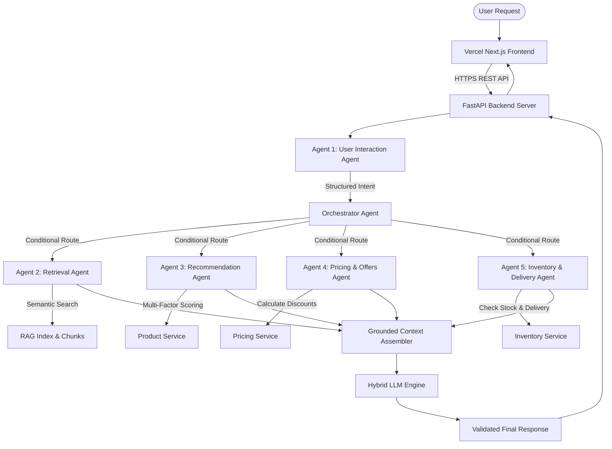

# ShopMind AI — Intelligent Multi-Agent E-Commerce Assistant

> **Tagline**: *Your Intelligent AI Shopping Companion*

ShopMind AI is a full-stack, production-ready web application demonstrating autonomous Multi-Agent orchestration, Retrieval-Augmented Generation (RAG), deterministic tool calling, and dynamic session conversation memory.

---

## 1. Multi-Agent Architecture



---

## 2. The 6 AI Agents & Responsibilities

1. **User Interaction Agent**: Converts natural language into structured JSON intent (`category`, `budget`, `brand`, `requirements`) and handles context-aware follow-ups (e.g. *"Show cheaper options"*).
2. **Retrieval Agent**: RAG retriever performing semantic search over product specs, customer reviews, store FAQs, and shipping policies.
3. **Recommendation Agent**: Multi-factor scoring model:
   $$\text{Match Score} = 0.35 \times \text{Budget\_Fit} + 0.35 \times \text{Rating} + 0.30 \times \text{Requirement\_Match}$$
4. **Pricing & Offers Agent**: Calculates original prices, active discounts, instant bank offers, and net payable prices.
5. **Inventory & Delivery Agent**: Fetches real-time stock status (`In Stock` / `Out of Stock`) and estimated shipping timelines (`2 business days`).
6. **Orchestrator Agent**: Conditional routing graph dynamically selecting required agents per query type without forcing simple queries through all agents.

---

## 3. Project Directory Structure

```text
E:\Desktop\LLM
├── backend/
│   ├── app/
│   │   ├── agents/          # UserInteraction, Orchestrator, Retrieval, Recommendation, Pricing, Inventory
│   │   ├── config/          # App settings & Pydantic env loading
│   │   ├── data/            # Prototype catalog JSONs, reviews, FAQs & policies
│   │   ├── db/              # SQLite database models & seed scripts
│   │   ├── llm/             # Hybrid LLM provider (Ollama, OpenAI, Mock) & prompts
│   │   ├── memory/          # Session conversation context manager
│   │   ├── rag/             # RecursiveTextChunker & RAG retriever
│   │   ├── services/        # Decoupled Product, Pricing, Inventory, Delivery, Cache & Feedback services
│   │   ├── tools/           # Deterministic product, pricing & inventory python tools
│   │   └── main.py          # FastAPI application entry point
│   ├── requirements.txt     # Production python dependencies
│   └── shopmind.db          # Database file
├── frontend/
│   ├── app/                 # Next.js 14 App Router (Page, Layout, Globals)
│   ├── components/          # Chat, Product Cards, Agent Activity Timeline, Compare
│   ├── lib/                 # Environment API client & TypeScript interfaces
│   ├── package.json         # Node.js dependencies
│   └── vercel.json          # Vercel deployment configuration
├── tests/
│   └── test_shopmind.py     # End-to-end automated pytest suite
├── .env.example             # Environment variable template
├── .gitignore               # Production git ignore rules
└── README.md                # Project documentation
```

---

## 4. Environment Variables Checklist

Copy `.env.example` to `.env` locally:

| Variable | Description | Example / Default |
| :--- | :--- | :--- |
| `LLM_PROVIDER` | LLM service provider (`mock`, `ollama`, `openai`) | `mock` |
| `OPENAI_API_KEY` | Production OpenAI API Key | `sk-...` |
| `OLLAMA_BASE_URL` | Local Ollama base URL | `http://localhost:11434` |
| `CORS_ORIGINS` | Allowed CORS origins for FastAPI | `http://localhost:3000,https://shopmind-ai.vercel.app` |
| `NEXT_PUBLIC_API_URL` | Frontend public API backend endpoint | `http://localhost:8000/api` |

---

## 5. Local Setup & Running Instructions

### Backend Setup:
```bash
cd backend
python -m venv venv
# Windows:
.\venv\Scripts\activate
# Linux/macOS:
source venv/bin/activate

pip install -r requirements.txt
python -m uvicorn app.main:app --host 0.0.0.0 --port 8000
```
Backend health check: `http://localhost:8000/api/health`

### Frontend Setup:
```bash
cd frontend
npm install
npm run dev
```
Open browser at `http://localhost:3000`

---

## 6. Testing

Run backend test suite covering all 10 scenario tests:
```bash
cd backend
python -m pytest ../tests/test_shopmind.py
```

---

## 7. Deployment Guide

### Deploy Frontend to Vercel:
1. Push project to GitHub.
2. In Vercel Dashboard, select **Add New Project** $
ightarrow$ Import `shopmind-ai`.
3. Set **Root Directory** to `frontend`.
4. Add Environment Variable:
   `NEXT_PUBLIC_API_URL=https://<your-deployed-backend-domain>/api`
5. Click **Deploy**.

### Deploy Backend to Render / Railway / Cloud Host:
1. Create a Web Service pointing to `backend/`.
2. Build Command: `pip install -r requirements.txt`
3. Start Command: `python -m uvicorn app.main:app --host 0.0.0.0 --port $PORT`
4. Add Environment Variables (`LLM_PROVIDER`, `OPENAI_API_KEY`, `CORS_ORIGINS`).

---

## 8. Disclaimer

> **Prototype Catalog Data Notice**: Product specifications, promotional discounts, inventory availability, shipping dates, and customer reviews are prototype/simulated catalog data. In production environments, replace `SimulatedPricingService` and `SimulatedInventoryService` with production ERP/E-Commerce APIs.

---

## 9. License

MIT License.
